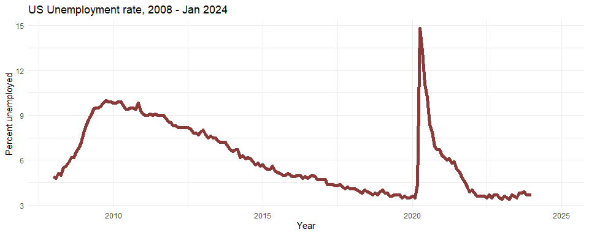
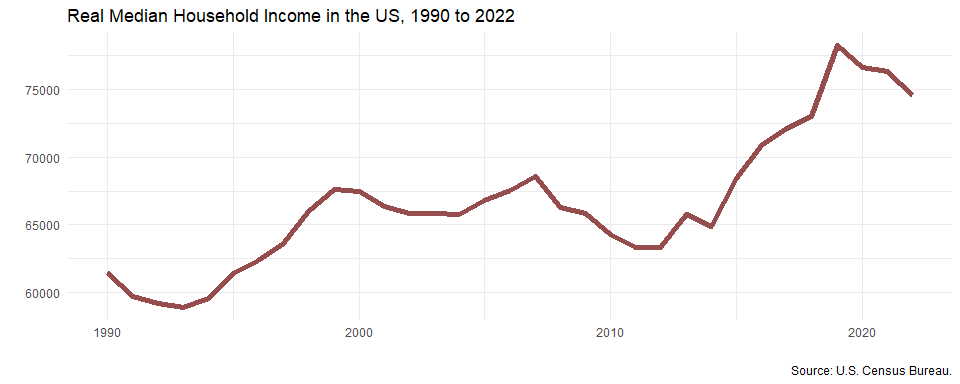

Workshop 4
================
YH
2024-02-07

- [Labor and employment](#labor-and-employment)
- [Demographics in Singapore](#demographics-in-singapore)
- [Real median household income](#real-median-household-income)
- [Realtime Carpark availability](#realtime-carpark-availability)

## Labor and employment

In the first practice, let’s visit the web page
<https://www.ncsl.org/research/labor-and-employment/national-employment-monthly-update.aspx>,
which contain a nicely formatted table on unemployment data. The data
were originally from the Bureau of Labor Statistics.

``` r
# Load packages
library(rvest)
library(tidyverse)
url = "https://www.ncsl.org/research/labor-and-employment/national-employment-monthly-update.aspx"
table = read_html(url) %>% html_elements("table") %>% html_table()
df_unemp <- table[[1]] %>%
  rename(year = 1)
df_unemp
```

<div class="kable-table">

| year | January | February | March | April |  May | June | July | August | September | October | November | December |
|-----:|--------:|---------:|------:|------:|-----:|-----:|-----:|-------:|----------:|--------:|---------:|---------:|
| 2024 |     3.7 |       NA |    NA |    NA |   NA |   NA |   NA |     NA |        NA |      NA |       NA |       NA |
| 2023 |     3.4 |      3.6 |   3.5 |   3.4 |  3.7 |  3.6 |  3.5 |    3.8 |       3.8 |     3.9 |      3.7 |      3.7 |
| 2022 |     4.0 |      3.8 |   3.6 |   3.6 |  3.6 |  3.6 |  3.5 |    3.7 |       3.5 |     3.7 |      3.7 |      3.5 |
| 2021 |     6.3 |      6.2 |   6.0 |   6.1 |  5.8 |  5.9 |  5.4 |    5.2 |       4.8 |     4.6 |      4.2 |      3.9 |
| 2020 |     3.6 |      3.5 |   4.4 |  14.8 | 13.3 | 11.1 | 10.2 |    8.4 |       7.9 |     6.9 |      6.7 |      6.7 |
| 2019 |     4.0 |      3.8 |   3.8 |   3.6 |  3.6 |  3.7 |  3.7 |    3.7 |       3.5 |     3.6 |      3.5 |      3.5 |
| 2018 |     4.1 |      4.1 |   4.0 |   3.9 |  3.8 |  4.0 |  3.9 |    3.8 |       3.7 |     3.8 |      3.7 |      3.9 |
| 2017 |     4.7 |      4.7 |   4.4 |   4.4 |  4.4 |  4.3 |  4.3 |    4.4 |       4.2 |     4.1 |      4.2 |      4.1 |
| 2016 |     4.9 |      4.9 |   5.0 |   5.0 |  4.8 |  4.9 |  4.8 |    4.9 |       5.0 |     4.9 |      4.7 |      4.7 |
| 2015 |     5.7 |      5.5 |   5.4 |   5.4 |  5.6 |  5.3 |  5.2 |    5.1 |       5.0 |     5.0 |      5.1 |      5.0 |
| 2014 |     6.6 |      6.7 |   6.7 |   6.2 |  6.3 |  6.1 |  6.2 |    6.1 |       5.9 |     5.7 |      5.8 |      5.6 |
| 2013 |     8.0 |      7.7 |   7.5 |   7.6 |  7.5 |  7.5 |  7.3 |    7.2 |       7.2 |     7.2 |      6.9 |      6.7 |
| 2012 |     8.3 |      8.3 |   8.2 |   8.2 |  8.2 |  8.2 |  8.2 |    8.1 |       7.8 |     7.8 |      7.7 |      7.9 |
| 2011 |     9.1 |      9.0 |   9.0 |   9.1 |  9.0 |  9.1 |  9.0 |    9.0 |       9.0 |     8.8 |      8.6 |      8.5 |
| 2010 |     9.8 |      9.8 |   9.9 |   9.9 |  9.6 |  9.4 |  9.4 |    9.5 |       9.5 |     9.4 |      9.8 |      9.3 |
| 2009 |     7.8 |      8.3 |   8.7 |   9.0 |  9.4 |  9.5 |  9.5 |    9.6 |       9.8 |    10.0 |      9.9 |      9.9 |
| 2008 |     4.9 |      4.8 |   5.1 |   5.0 |  5.5 |  5.6 |  5.8 |    6.2 |       6.2 |     6.6 |      6.8 |      7.2 |

</div>

``` r
# Convert it into tidy format and plot data
df_unemp %>% pivot_longer(January:December, names_to = "month", values_to = "unemp_rate") %>%
  mutate(yr_month = ym(paste(year, month, sep = "-"))) %>%
  ggplot(aes(x = yr_month, y = unemp_rate)) +
  geom_line(lwd = 2, color = "indianred4") +
  theme_minimal() +
  labs(title = "US Unemployment rate, 2008 - Jan 2024",
       y = "Percent unemployed", x = "Year")
```

<!-- -->

## Demographics in Singapore

Next, we will obtain two tables from the following web page on the
Demographics of Singapore.

<https://en.wikipedia.org/wiki/Demographics_of_Singapore>

``` r
url <- "https://en.wikipedia.org/wiki/Demographics_of_Singapore"
tables <- read_html(url) %>% html_elements("table")
# Number of tables available
paste("There are", length(tables), "tables on the web page.")
```

    ## [1] "There are 50 tables on the web page."

``` r
df_gender <- read_html(url) %>% 
  html_element("#mw-content-text > div.mw-content-ltr.mw-parser-output > table:nth-child(53)") %>%
  html_table()

df_income <- read_html(url) %>% 
  html_element("#mw-content-text > div.mw-content-ltr.mw-parser-output > table:nth-child(126)") %>%
  html_table()

df_gender; df_income
```

<div class="kable-table">

| Year                                | 1960    | 1965    | 1970    | 1975    | 1980    | 1985    | 1990    | 1995    | 2000    | 2005    | 2010    | 2015    | 2020    |
|:------------------------------------|:--------|:--------|:--------|:--------|:--------|:--------|:--------|:--------|:--------|:--------|:--------|:--------|:--------|
| Total                               | 1,646.4 | 1,886.9 | 2,013.6 | 2,262.6 | 2,282.1 | 2,482.6 | 2,735.9 | 3,013.5 | 3,273.4 | 3,467.8 | 3,771.7 | 3,902.7 | 4,044.2 |
| Males                               | 859.6   | 973.8   | 1,030.8 | 1,156.1 | 1,159.0 | 1,258.5 | 1,386.3 | 1,514.0 | 1,634.7 | 1,721.1 | 1,861.1 | 1,916.6 | 1,977.6 |
| Females                             | 786.8   | 913.1   | 982.8   | 1,106.5 | 1,123.1 | 1,224.2 | 1,349.6 | 1,499.5 | 1,638.7 | 1,746.7 | 1,910.6 | 1,986.1 | 2,066.7 |
| Sex ratio (males per 1,000 females) | 1,093   | 1,066   | 1,049   | 1,045   | 1,032   | 1,028   | 1,027   | 1,010   | 998     | 985     | 974     | 965     | 957     |

</div>

<div class="kable-table">

| Year           | 1990  | 1995  | 1997  | 1998  | 1999  | 2000  | 2010  | 2011  | 2017   |
|:---------------|:------|:------|:------|:------|:------|:------|:------|:------|:-------|
| Average income | 3,076 | 4,107 | 4,745 | 4,822 | 4,691 | 4,943 | 8,726 | 9,618 | 11,589 |
| Median income  | 2,296 | 3,135 | 3,617 | 3,692 | 3,500 | 3,607 | 5,600 | 6,307 | 8,846  |

</div>

## Real median household income

As API calls to FRED requires an API key, we need to sign up for an API
key first.

- It’s important to keep your API key private.

- In the code below, my API key is retrieved in
  `Sys.getenv("FRED_KEY")`. This is one way to keep the API key secret.
  You can find out more about it
  [here](https://daattali.gitbooks.io/stat545-ubc-github-io/content/bit003_api-key-env-var.html).

``` r
library(httr)
resource_url <- "https://api.stlouisfed.org/fred/series/observations"
query_params = list(api_key = Sys.getenv("FRED_KEY"),
                    series_id = "MEHOINUSA672N",
                    file_type = "json")
# Request data from the server
res = GET(resource_url, query = query_params)

# Parse JSON
library(jsonlite)
res_list <- content(res, type = "text") %>% fromJSON(flatten = TRUE)
# Convert data into tibble
income <- as_tibble(res_list$observations)

# Plots
income %>%
  mutate(year = year(date), value = as.numeric(value)) %>%
  filter(year >= 1990) %>%
  ggplot(aes(x = year, y = value)) +
  geom_line(lwd = 2, color = "indianred4", alpha = 0.9) +
  theme_minimal() +
  labs(x = "", y = "", title = "Real Median Household Income in the US, 1990 to 2022",
       caption = "Source: U.S. Census Bureau.")
```

<!-- -->

## Realtime Carpark availability

To query data from the LTA DataMall, we also need to request an API key.

- In the code below, my API key is retrieved in `Sys.getenv("LTA_KEY")`.

- Read the LTA’s **documentation** for their APIs and understand how to
  set up the `GET()` requests.

``` r
# Construct the resource URL
resource_url <- "http://datamall2.mytransport.sg/ltaodataservice/CarParkAvailabilityv2"
# Make the GET() request
res <- GET(resource_url, 
           add_headers(AccountKey = Sys.getenv("LTA_KEY"),
                       accept = "application/json"))
# Parse the returned data
res_content <- content(res, as = "text")
res_list <- fromJSON(res_content, flatten = TRUE)
# Extract information from sub-list
df_carpark <- as_tibble(res_list$value)
head(df_carpark)
```

<div class="kable-table">

| CarParkID | Area   | Development        | Location          | AvailableLots | LotType | Agency |
|:----------|:-------|:-------------------|:------------------|--------------:|:--------|:-------|
| 1         | Marina | Suntec City        | 1.29375 103.85718 |           657 | C       | LTA    |
| 2         | Marina | Marina Square      | 1.29115 103.85728 |          1227 | C       | LTA    |
| 3         | Marina | Raffles City       | 1.29382 103.85319 |           484 | C       | LTA    |
| 4         | Marina | The Esplanade      | 1.29011 103.85561 |           626 | C       | LTA    |
| 5         | Marina | Millenia Singapore | 1.29251 103.86009 |           607 | C       | LTA    |
| 6         | Marina | Singapore Flyer    | 1.28944 103.86311 |           237 | C       | LTA    |

</div>

### The `ltaer` package

Additionally, there’s an API client `R` package, `ltaer`, that help us
obtain data from the LTA DataMall.

- Read the full documentation of the package
  [here](https://shaunkhoo.github.io/ltaer/index.html).

``` r
# Install the package
install.packages('devtools')
devtools::install_github('shaunkhoo/ltaer', force = TRUE)
```

- To obtain data via this API wrapper, we still need to supply our own
  API KEY.

- The data set on carpark availability can be retrieved with:

``` r
# Retrieve data on carpark availability
carpark_avail <- ltaer::getCarparkAvail(Sys.getenv("LTA_KEY"))
head(carpark_avail)
```

<div class="kable-table">

| CarParkID | Area   | Development        | Location          | AvailableLots | LotType | Agency | lat     | lng       |
|:----------|:-------|:-------------------|:------------------|--------------:|:--------|:-------|:--------|:----------|
| 1         | Marina | Suntec City        | 1.29375 103.85718 |           657 | C       | LTA    | 1.29375 | 103.85718 |
| 2         | Marina | Marina Square      | 1.29115 103.85728 |          1227 | C       | LTA    | 1.29115 | 103.85728 |
| 3         | Marina | Raffles City       | 1.29382 103.85319 |           484 | C       | LTA    | 1.29382 | 103.85319 |
| 4         | Marina | The Esplanade      | 1.29011 103.85561 |           626 | C       | LTA    | 1.29011 | 103.85561 |
| 5         | Marina | Millenia Singapore | 1.29251 103.86009 |           607 | C       | LTA    | 1.29251 | 103.86009 |
| 6         | Marina | Singapore Flyer    | 1.28944 103.86311 |           237 | C       | LTA    | 1.28944 | 103.86311 |

</div>
