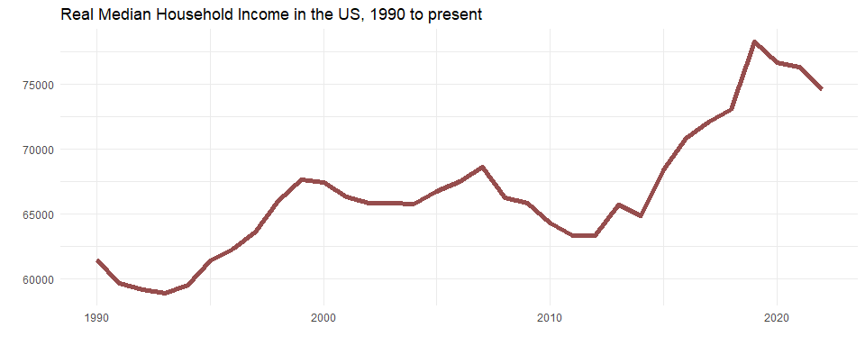

Workshop 4
================
YH
2024-02-05

- [Labor and employment](#labor-and-employment)
- [Household income](#household-income)
- [Realtime Carpark availability](#realtime-carpark-availability)

## Labor and employment

Query data from
<https://www.ncsl.org/research/labor-and-employment/national-employment-monthly-update.aspx>,
which contain unemployment data originally from the Bureau of Labor
Statistics

``` r
library(rvest)
library(tidyverse)
url = "https://www.ncsl.org/research/labor-and-employment/national-employment-monthly-update.aspx"
table = read_html(url) %>% html_elements("table") %>% html_table()
df_unemp <- table[[1]] %>%
  rename(year = 1)
df_unemp
```

<div class="kable-table">

| year | January | February | March | April |  May | June | July | August | September | October | November | December |
|-----:|--------:|---------:|------:|------:|-----:|-----:|-----:|-------:|----------:|--------:|---------:|---------:|
| 2024 |     3.7 |       NA |    NA |    NA |   NA |   NA |   NA |     NA |        NA |      NA |       NA |       NA |
| 2023 |     3.4 |      3.6 |   3.5 |   3.4 |  3.7 |  3.6 |  3.5 |    3.8 |       3.8 |     3.9 |      3.7 |      3.7 |
| 2022 |     4.0 |      3.8 |   3.6 |   3.6 |  3.6 |  3.6 |  3.5 |    3.7 |       3.5 |     3.7 |      3.7 |      3.5 |
| 2021 |     6.3 |      6.2 |   6.0 |   6.1 |  5.8 |  5.9 |  5.4 |    5.2 |       4.8 |     4.6 |      4.2 |      3.9 |
| 2020 |     3.6 |      3.5 |   4.4 |  14.8 | 13.3 | 11.1 | 10.2 |    8.4 |       7.9 |     6.9 |      6.7 |      6.7 |
| 2019 |     4.0 |      3.8 |   3.8 |   3.6 |  3.6 |  3.7 |  3.7 |    3.7 |       3.5 |     3.6 |      3.5 |      3.5 |
| 2018 |     4.1 |      4.1 |   4.0 |   3.9 |  3.8 |  4.0 |  3.9 |    3.8 |       3.7 |     3.8 |      3.7 |      3.9 |
| 2017 |     4.7 |      4.7 |   4.4 |   4.4 |  4.4 |  4.3 |  4.3 |    4.4 |       4.2 |     4.1 |      4.2 |      4.1 |
| 2016 |     4.9 |      4.9 |   5.0 |   5.0 |  4.8 |  4.9 |  4.8 |    4.9 |       5.0 |     4.9 |      4.7 |      4.7 |
| 2015 |     5.7 |      5.5 |   5.4 |   5.4 |  5.6 |  5.3 |  5.2 |    5.1 |       5.0 |     5.0 |      5.1 |      5.0 |
| 2014 |     6.6 |      6.7 |   6.7 |   6.2 |  6.3 |  6.1 |  6.2 |    6.1 |       5.9 |     5.7 |      5.8 |      5.6 |
| 2013 |     8.0 |      7.7 |   7.5 |   7.6 |  7.5 |  7.5 |  7.3 |    7.2 |       7.2 |     7.2 |      6.9 |      6.7 |
| 2012 |     8.3 |      8.3 |   8.2 |   8.2 |  8.2 |  8.2 |  8.2 |    8.1 |       7.8 |     7.8 |      7.7 |      7.9 |
| 2011 |     9.1 |      9.0 |   9.0 |   9.1 |  9.0 |  9.1 |  9.0 |    9.0 |       9.0 |     8.8 |      8.6 |      8.5 |
| 2010 |     9.8 |      9.8 |   9.9 |   9.9 |  9.6 |  9.4 |  9.4 |    9.5 |       9.5 |     9.4 |      9.8 |      9.3 |
| 2009 |     7.8 |      8.3 |   8.7 |   9.0 |  9.4 |  9.5 |  9.5 |    9.6 |       9.8 |    10.0 |      9.9 |      9.9 |
| 2008 |     4.9 |      4.8 |   5.1 |   5.0 |  5.5 |  5.6 |  5.8 |    6.2 |       6.2 |     6.6 |      6.8 |      7.2 |

</div>

``` r
# Convert it into tidy format and plot data
df_unemp %>% pivot_longer(January:December, names_to = "month", values_to = "unemp_rate") %>%
  mutate(yr_month = ym(paste(year, month, sep = "-"))) %>%
  ggplot(aes(x = yr_month, y = unemp_rate)) +
  geom_line(lwd = 2, color = "indianred4") +
  theme_minimal() +
  labs(title = "US Unemployment rate, 2008 - Jan 2024",
       y = "Percent unemployed", x = "Year")
```

<!-- -->

## Household income

As API calls to FRED requires an API key, we need to sign up for an API
key first.

- It’s important to keep your API key private.

- In the code below, my API key is saved as `Sys.getenv("FRED_KEY")`.
  This is one way to keep the API key secret. You can find out more
  about it
  [here](https://daattali.gitbooks.io/stat545-ubc-github-io/content/bit003_api-key-env-var.html).

``` r
library(httr)
base_url <- "https://api.stlouisfed.org"
endpoint <- "/fred/series/observations"
resource_url <- paste0(base_url, endpoint)
query_params = list(api_key = Sys.getenv("FRED_KEY"),
                    series_id = "MEHOINUSA672N",
                    file_type = "json")
# Request data from the server
res = GET(resource_url, query = query_params)

# Parse JSON
library(jsonlite)
res_list <- content(res, type = "text") %>% fromJSON(flatten = TRUE)
# Convert data into tibble
income <- as_tibble(res_list$observations)

# Plots
income %>%
  mutate(year = year(date), value = as.numeric(value)) %>%
  filter(year >= 1990) %>%
  ggplot(aes(x = year, y = value)) +
  geom_line(lwd = 2, color = "indianred4", alpha = 0.9) +
  theme_minimal() +
  labs(x = "", y = "", title = "Real Median Household Income in the US, 1990 to present")
```

<!-- -->

## Realtime Carpark availability

``` r
# Construct the resource URL
base_url <- "http://datamall2.mytransport.sg"
endpoint <- "/ltaodataservice/CarParkAvailabilityv2"
resource_url <- paste0(base_url, endpoint)
# Make the request and parse the returned data
res <- GET(resource_url, 
           add_headers(AccountKey = Sys.getenv("LTA_KEY"),
                       accept = "application/json"))
res_content <- content(res, as = "text")
res_list <- fromJSON(res_content, flatten = TRUE)
# Extract information from sublist
df_carpark <- as_tibble(res_list$value)
head(df_carpark)
```

<div class="kable-table">

| CarParkID | Area   | Development        | Location          | AvailableLots | LotType | Agency |
|:----------|:-------|:-------------------|:------------------|--------------:|:--------|:-------|
| 1         | Marina | Suntec City        | 1.29375 103.85718 |           793 | C       | LTA    |
| 2         | Marina | Marina Square      | 1.29115 103.85728 |          1201 | C       | LTA    |
| 3         | Marina | Raffles City       | 1.29382 103.85319 |           457 | C       | LTA    |
| 4         | Marina | The Esplanade      | 1.29011 103.85561 |           625 | C       | LTA    |
| 5         | Marina | Millenia Singapore | 1.29251 103.86009 |           518 | C       | LTA    |
| 6         | Marina | Singapore Flyer    | 1.28944 103.86311 |           246 | C       | LTA    |

</div>
